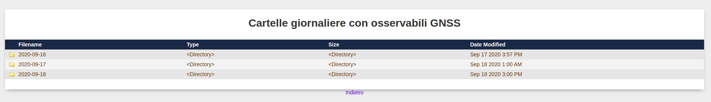
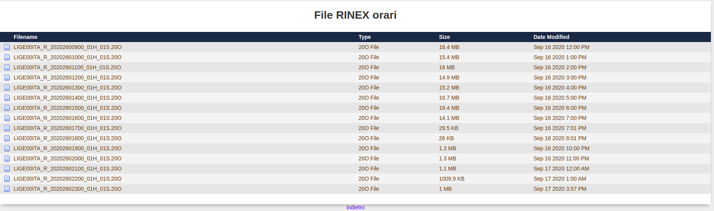

# Record and Store GNSS raw data form ublox receivers
This repository contains some script for automatically record raw GNSS data in ubx property format, convert them in RINEX format and compress them by Hatanaka compression format.

The script are thought for a ublox receiver plugged to a raspberry through a usb cable. Moreover the scripts have been conceived for a Linux (Debian-like) operating system.

To record raw data the free and open source rtklib sofwater is exploited. In particular the modules str2str and convbin are used, so they have to be downloaded and compiled. [Download RTKLIB here](https://github.com/tomojitakasu/RTKLIB "RTKLIB git hub repository").

If you use double frequency receivers with also Galileo constellation, the suggestion is to use the RTKLIB demo 5 version. [Download it here](https://github.com/rtklibexplorer/RTKLIB/tree/demo5).

In order to make the script work, app str2str and convbin must be compiled. To compile str2str go into `/RTKLIB/app/str2str/gcc` and give the comand `make`. Same thing for convbin
 
In the record_raw_gnss_dev.py script are also implemented function to automatically upload the recorded data, in RINEX format, to a ftp server.
In order to make this function work properly a file named credenziali.py must be created in the same folder. The structure of credenziali.py is:
```python

ftp_url='ftp.myserver.com' #insert your server address
ftp_user='user' #insert your user
ftp_password='password' #insert your password

```
A function to eliminate the recorded files once uploaded is also implemented in order not to fill the raspberry storage memory

The user have to specify the following inputs:
* time for data acquisition in minutes
* path to rtklib modules
* usb serial port
* name and path to remote folder (hosted in the ftp server)

It's possible to record hourly files using this script by scheduling the script in the cron job. For example you can add the following line to the /etc/crontab file


```
0 *  * * *   pi /usr/bin/python3 /home/pi/REPOSITORY/raw_data_from_ublox/record_raw_gnss_dev.py > /tmp/record_raw_gnss.log 2>&1

```

The script generate also daily folder where hourly files are stored in a orderly way:





By running record_raw_gnss.py three file are generated and saved in the properly folders:
* raw GNSS data in ubx format, in ./output_ubx
* raw GNSS data in RINEX format in ./output_rinex


## Create daily RINEX file

The script create_daily_rinex.py creates a daily rinex file using the hourly file registered. In particular the script:
* downloads all the rinex file registered the day before
* resamples all the files from 1s to 30s (this operation is crutial in order not to create too big files) and eliminates the original files
* splices all the files in a single file automatically named with the RINEX 3 convenction
* eliminates all the 24 hourly files (the ones resampled)
* uploads the daily file to the ftp server and eliminates it from the local storage
The resample and the splice of the files are done thanks to the gfzrnx program. You can find more information about this software at the following [link]("https://dataservices.gfz-potsdam.de/panmetaworks/showshort.php?id=escidoc:1577894").

The script create_daily_rinex.py should run once a day. For this reason a good choise is to put this script in the /etc/crontab file. For example you can add the following line:

```
00 11   * * *   ubuntu   /usr/bin/python3 /home/ubuntu/raw_data_from_ublox/create_daily_rinex.py > /tmp/daily_rinex_creation.log 2>&1 

```
